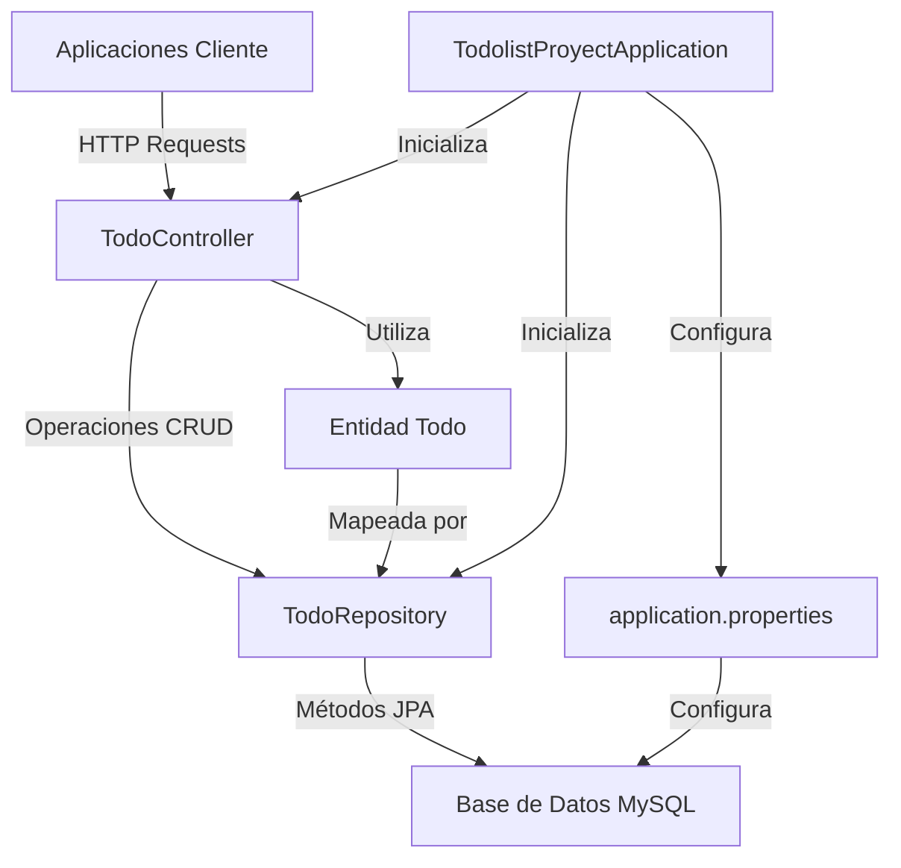
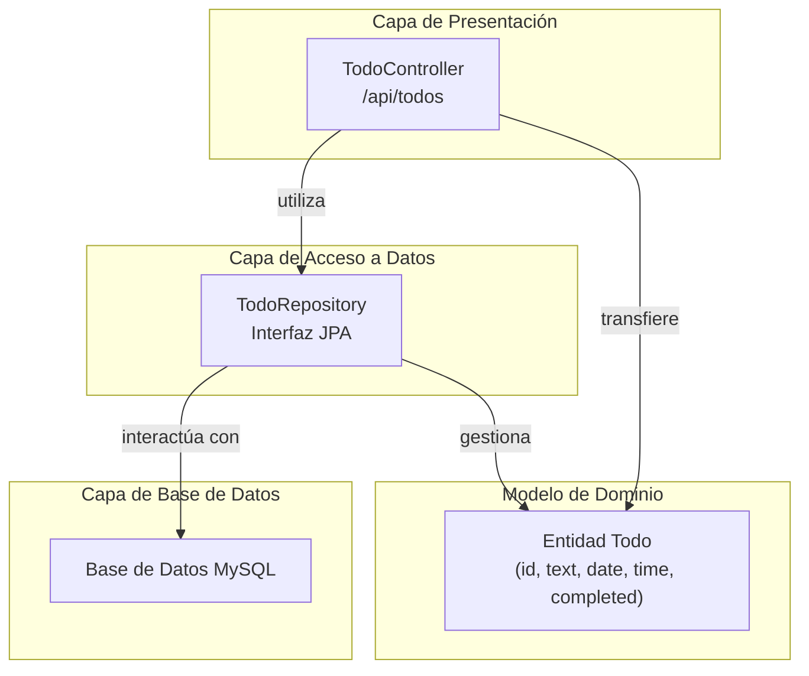
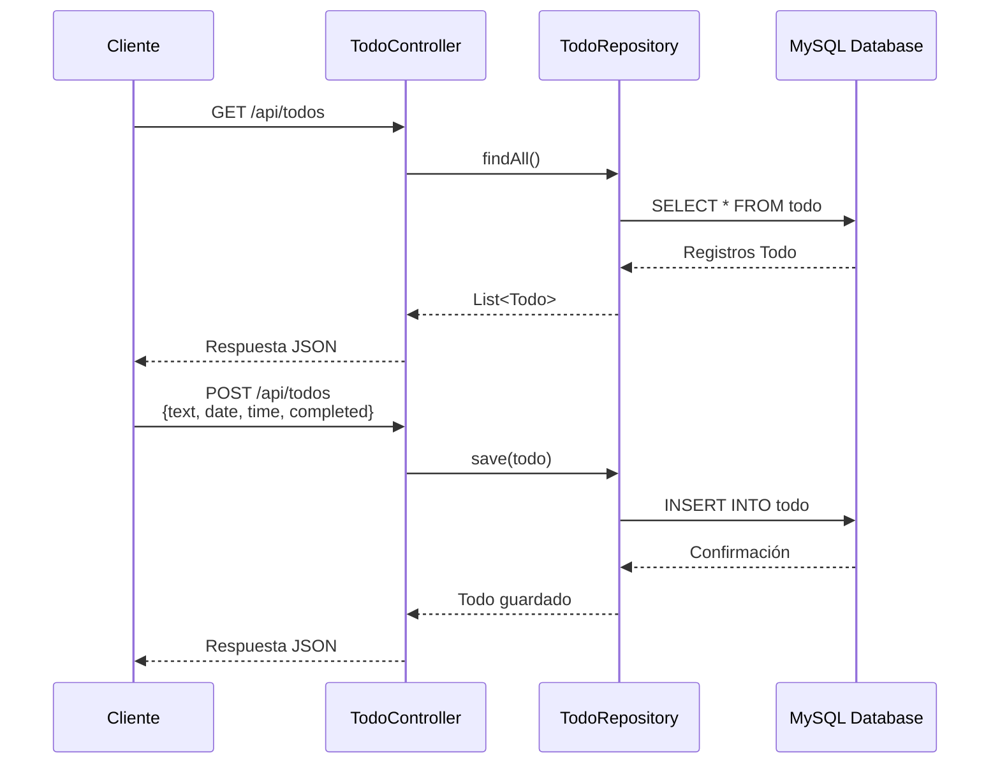

# TodoList Backend API
API REST para gestión de tareas desarrollada con Spring Boot y MySQL.


## 🛠️ Tecnologías principales
- 🍃 Spring Boot 3.4.2
- 📦 Spring Data JPA
- 🗃️ MySQL 8.0
- 🛠️ Maven
- 🔄 Hibernate

## 🏗️ Arquitectura del Sistema



### Capas de la Arquitectura



## 📁 Estructura del Proyecto

```
todolistapp-backend/
├── src/
│   └── main/
│       ├── java/com/app/todolist/
│       │   ├── controller/                         # Controladores REST
│       │   │   └── TodoController.java
│       │   ├── entity/                             # Entidades de base de datos
│       │   │   └── Todo.java
│       │   ├── repository/                         # Repositorios JPA
│       │   │   └── TodoRepository.java
│       │   └── TodolistProyectApplication.java     # Clase main
│       └── resources/
│           └── application.properties              # Config DB
└── pom.xml                                         # Dependencias Maven
```

## 🔧 Componentes Principales

### 1. Aplicación Principal
**`TodolistProyectApplication`** - Punto de entrada de la aplicación Spring Boot 

### 2. Controlador REST
**`TodoController`** - Maneja las peticiones HTTP y define los endpoints de la API REST

### 3. Repositorio de Datos
**`TodoRepository`** - Interfaz JPA que proporciona operaciones de acceso a datos 

### 4. Entidad de Dominio
**`Todo`** - Modelo de dominio que representa un elemento de tarea 

## 🌐 Endpoints de la API

| Método | Endpoint       | Función | Descripción                    |
|--------|----------------|---------|--------------------------------|
| GET    | /api/todos     | `getAllTodos()` | Obtener todas las tareas       |
| POST   | /api/todos     | `createTodo()` | Crear nueva tarea              |
| PUT    | /api/todos/{id}| `toggleComplete()` | Actualizar estado completado   |
| DELETE | /api/todos/{id}| `deleteTodo()` | Eliminar tarea                 | 

### Flujo de Peticiones



## 🚀 Instalación y Ejecución

### Prerrequisitos
- Java 17+
- Maven 3.6+
- MySQL 8.0+

### Ejecutar la aplicación
```bash
mvn spring-boot:run
```

### La API estará disponible en:
- http://localhost:8080 

## 📝 Ejemplos de Uso

### Crear una nueva tarea (POST)
```json
{
  "text": "Toca pajita",
  "date": "2025-01-30",
  "time": "18:00:00",
  "completed": false
}
```

### Configuración CORS
La aplicación está configurada para permitir CORS desde `http://localhost:3000` para integración con aplicaciones frontend como Next.js. 

## Notes

El proyecto sigue una arquitectura multicapa estándar de Spring Boot con una estructura simplificada sin capa de servicio separada. La lógica de negocio se implementa directamente en el controlador, lo que es apropiado para una aplicación de este tamaño. La aplicación utiliza Spring Data JPA para el acceso a datos y aprovecha la auto-configuración de Spring Boot para la configuración de componentes.
